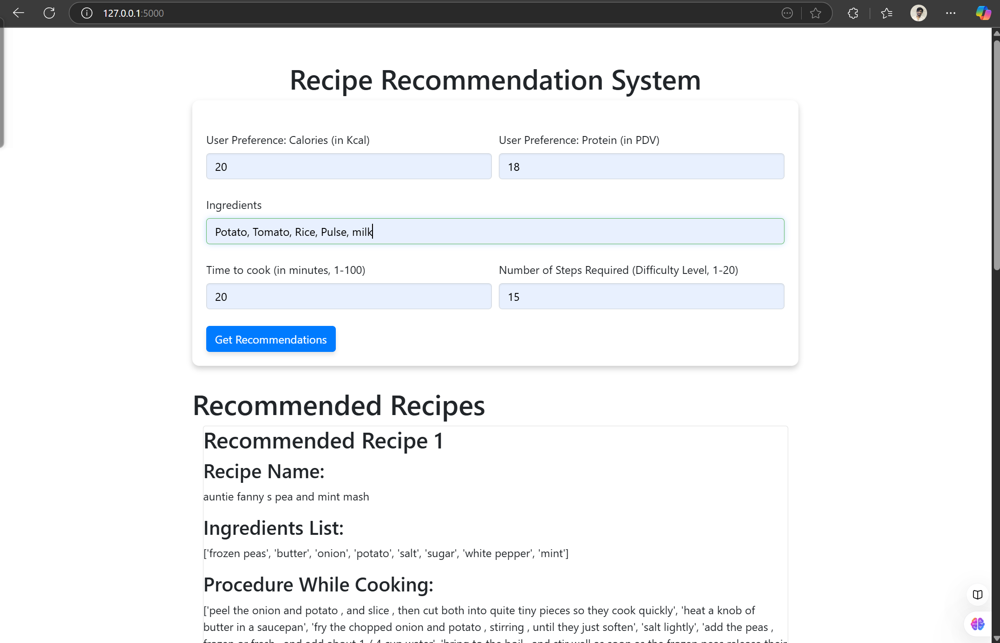

# **Recipe Recommendation System**

---

## **Introduction**

The Recipe Recommendation System is designed to provide personalized and dynamic recipe recommendations by leveraging the **Food.com Recipes and Interactions dataset** (`RAW_recipes.csv`). This dataset contains a rich collection of recipes, including fields like recipe names, ingredients, cooking steps, and user reviews. With over **200K recipes** and their associated interactions, the goal was to extract meaningful insights and deliver an intuitive user experience through a recommender system.

---

## **Dataset**

The **Food.com Recipes and User Interactions** dataset contains recipes along with user interaction data, such as ratings and reviews. This dataset provides a comprehensive foundation for building a recommendation system by combining recipe details with user feedback.

- **Dataset Highlights**:
  - Includes recipe names, ingredients, cooking steps, and user reviews.
  - Over **200K recipes** with associated interactions.

- **Download**:
  - The dataset can be downloaded from [Kaggle](https://www.kaggle.com/datasets/shuyangli94/food-com-recipes-and-user-interactions?resource=download&select=RAW_recipes.csv).

---

## **Approach**

### **1. Dataset Preprocessing**
The `RAW_recipes.csv` dataset was first explored and analyzed for its structure and contents. The following steps were carried out to prepare the data:
- **Handling Missing Values**: Incomplete rows with missing recipe names, ingredients, or steps were filtered out.
- **Outlier Detection**: Recipes with unusually high numbers of steps or ingredients (e.g., >50 steps) were identified as potential outliers and excluded to reduce noise in the recommendations.
- **Text Cleaning**: Ingredients and steps were cleaned to remove punctuation, special characters, and unnecessary whitespace.

### **2. Feature Engineering**
- **TF-IDF Encoding**: 
  - Textual fields such as `ingredients` and `steps` were converted into numerical representations using **TF-IDF (Term Frequency-Inverse Document Frequency)** encoding. 
  - This encoding allowed us to capture the importance of terms relative to the entire dataset, making the recommendation process more effective.


### **3. Model Implementation**
- **Content-Based Filtering**:
  - Focused on recommending recipes similar to the ones the user interacted with, based on textual features.
Several models were experimented with to generate recommendations:
- 1. **K-Nearest Neighbors (KNN)**:
  - Implemented a similarity-based approach to recommend recipes based on their TF-IDF embeddings.
  - Recipes with similar ingredient profiles and cooking steps were identified and ranked.
- 2. **Cosine Similarity**:
  - Used cosine similarity metrics on TF-IDF vectors to find the most relevant recipes for a user.


---

## **Challenges**

### **1. Curse of Dimensionality**
- The dataset contained a vast amount of textual data, resulting in extremely high-dimensional TF-IDF vectors. This made it challenging to efficiently compute similarities without running into performance bottlenecks.
  
### **2. Memory Allocation Errors**
- Due to the large dataset size and high-dimensional feature space, memory allocation errors were encountered during similarity computation, especially with models like KNN and cosine similarity.

### **3. Balancing Trade-offs**
- Achieving a balance between reducing dimensionality and retaining the semantic richness of the recipes was a significant challenge. Over-reduction led to loss of important features, while under-reduction increased computational overhead.

---

## **Working Demo**

Below are some screenshots showcasing the user interface and functionality of the Recipe Recommendation System:

1. **Homepage**:
   


2. **Recipe Recommendation Results**:
   

   


## **Future Work**

### **1. Embedding-Based Models**
- Explore embedding models like **BERT**, **Sentence Transformers**, or other **LLM-based models** (e.g., GPT) to encode recipes into dense, low-dimensional vectors.
- These embeddings can better capture the **context** and **semantic meaning** of recipes, improving recommendation quality.
  
### **2. LLM-Powered Recommender System**
- Develop an advanced recommender system utilizing **Large Language Models (LLMs)** to:
  - Understand user preferences more effectively.
  - Provide personalized recommendations by leveraging the contextual richness of LLMs.
  - Overcome limitations of traditional approaches, such as sparse data and high dimensionality.

### **4. Collaborative Filtering**
- Combine content-based filtering with collaborative filtering techniques to provide hybrid recommendations, leveraging both recipe data and user interaction data.

### **5. Cloud Deployment**
- Deploy the system on scalable cloud platforms to handle large-scale datasets and real-time user requests.

---

## **Conclusion**

The Recipe Recommendation System demonstrates the potential of combining TF-IDF encoding, similarity-based modeling, and efficient dimensionality reduction techniques for personalized recipe recommendations. By transitioning to embedding-based approaches and leveraging LLMs in the future, the system can achieve greater scalability, context-awareness, and user satisfaction.

---


## **How to Use**

### 1. Run the Application

To set up and run the project, follow these steps:

1. Clone the repository to your local machine.
2. Navigate to the project directory.
3. Install the required dependencies by running the following command:

   ```bash
   pip install -r requirements.txt
   ```

4. Download the dataset (`RAW_recipes.csv`) into the current directory. You can find the dataset [here](https://www.kaggle.com/datasets/shuyangli94/food-com-recipes-and-user-interactions?resource=download&select=RAW_recipes.csv).

5. Open and run the `Data Preparing` notebook to generate the `recipe_cleaned.csv` file in the current directory.

6. Start the Flask application by running the following command:

   ```bash
   flask run
   ```

7. Open your browser and navigate to `http://127.0.0.1:5000` to access the application.

---
